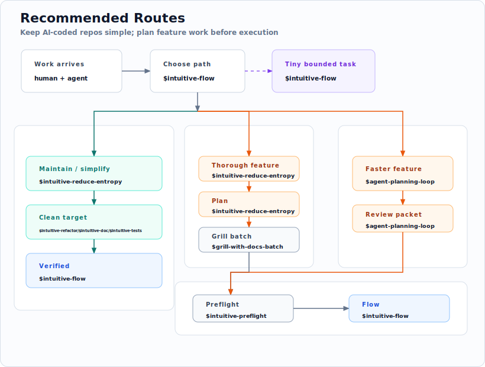

# intuitive-flow

**An opinionated operating model for agent-written software.**

`intuitive-flow` is a portable workflow kit for Claude Code and Codex. It keeps
the human surface small, puts reusable workflows in skills, and gives each repo
local `CLAUDE.md` / `AGENTS.md` guidance instead of a copied process manual.

[](LICENSE)
[](scripts/)
[](CLAUDE.md)
[](AGENTS.md)

<p align="center">
  
</p>

<p align="center">
  <a href="https://miaodx.com/LIP/share/ultrathink-to-goal/"><strong>From Ultrathink to Goal - A Year of AI Coding Engineering</strong></a><br>
  <sub><i>The interactive slide deck behind this kit · 中文</i></sub>
</p>

## Why This Exists

AI agents write all my code, so the repo needs two surfaces.

The human surface should **stay tiny**: `README.md`, `ARCHITECTURE.md`,
`STATUS.md`, and `docs/human/**`. This is where I decide what the project is,
what good means, and what must not break.

Everything else is agent territory: source code, plans, logs, generated
evidence, retrospectives, scratch work, and low-level churn. Humans can inspect
it when something is risky or broken. They should not have to live there.

`intuitive-flow` exists to make the counter-pressure explicit. AI coding changes
the default shape of a repo: agents are good at adding code, tests, plans, logs,
and helper surfaces, but they are less likely to stop and ask whether the repo
became easier to understand.

The first job is **maintenance through entropy reduction**. A repo needs regular
passes that remove stale surfaces, merge duplicate guidance, clean known seams,
realign docs with code, and make the next human or agent less surprised.

The second job is **deliberate feature development**. New work should not jump
straight from idea to implementation when the scope is fuzzy. It should become a
plan, get challenged against the repo's language and boundaries, turn into an
execution contract, and only then be implemented and verified.

See [BELIEFS.md](BELIEFS.md) for the doctrine behind this workflow.

The operating bias is deliberately small:

- Less is more.
- Codex, Claude Code, similar harnesses, and models will keep evolving; refresh
  skills against them.
- Prefer community best practices when they survive local review.

## Choose A Path

Start by choosing the kind of work:

| Work | Route |
| --- | --- |
| Maintain or simplify a repo | `$intuitive-reduce-entropy` in repo entropy mode, then route selected cleanup to the owning skill and verify it |
| Build a feature with the thorough path | `$intuitive-reduce-entropy` in plan mode -> plan -> repeat until blind spots are gone -> `$grill-with-docs-batch` -> `$intuitive-preflight` -> `$intuitive-flow` |
| Build a feature with the faster path | `$agent-planning-loop` -> plan or review packet -> `$intuitive-preflight` -> `$intuitive-flow` |
| Do a tiny bounded task | `$intuitive-flow` directly, when the change is local and easy to verify |

The rule of thumb is simple: reduce repo entropy when the codebase itself is
getting harder to work in; use a planning path when the next feature is still
unclear; use direct flow only when the task is already bounded.

<p align="center">
  
</p>

## Selected Skill Sources

The default install surface is explicit, not a broad import. This repo selects
individual skills in
[`scripts/default-skill-allowlist.txt`](scripts/default-skill-allowlist.txt)
and leaves the rest upstream until real use justifies promotion.

| Source | Stars | Selected | Skills used |
| --- | --- | --- | --- |
| [`anthropics/skills`](https://github.com/anthropics/skills) | [](https://github.com/anthropics/skills) | 1/18 | `skill-creator` |
| [`skills-directory/skill-codex`](https://github.com/skills-directory/skill-codex) | [](https://github.com/skills-directory/skill-codex) | 1/1 | `codex` |
| [`mattpocock/skills`](https://github.com/mattpocock/skills) | [](https://github.com/mattpocock/skills) | 5/35 | `grill-with-docs`, `handoff`, `improve-codebase-architecture`, `tdd`, `zoom-out` |
| [`DietrichGebert/ponytail`](https://github.com/DietrichGebert/ponytail) | [](https://github.com/DietrichGebert/ponytail) | 5/6 | `ponytail`, `ponytail-audit`, `ponytail-debt`, `ponytail-help`, `ponytail-review` |
| [`garrytan/gstack`](https://github.com/garrytan/gstack) | [](https://github.com/garrytan/gstack) | 7/55 | `gstack-autoplan`, `gstack-browse`, `gstack-investigate`, `gstack-open-gstack-browser`, `gstack-plan-eng-review`, `gstack-qa`, `gstack-review` |
| [`open-gsd/gsd-core`](https://github.com/open-gsd/gsd-core) | [](https://github.com/open-gsd/gsd-core) | 3/69 | `gsd-pause-work`, `gsd-progress`, `gsd-resume-work` |

Ratios are a current snapshot from the allowlist and upstream skill discovery.

## Optional Tool Install

Clone Intuitive Flow when you want the update scripts and local skill sync:

```bash
git clone --depth=1 https://github.com/MiaoDX/intuitive-flow.git ~/intuitive-flow
~/intuitive-flow/scripts/update.sh
```

For local development in this checkout:

```bash
bun install
bun run setup:hooks
bun run verify
```

## Current Map

- [ARCHITECTURE.md](ARCHITECTURE.md): subsystem contracts, extension points, and proof boundaries
- [STATUS.md](STATUS.md): current state, supported commands, and maintenance focus
- [docs/human/](docs/human/): human-facing detail that should not bloat the root docs
- [Reduce repo entropy](docs/human/reduce-repo-entropy.md): copy/paste prompts for repo maintenance and plan entropy work
- [BELIEFS.md](BELIEFS.md): supporting doctrine behind the workflow

Generated diagrams, vendored tools, planning scratchpads, and implementation
evidence are context, not current truth unless a human doc promotes them.

## Contributing

PRs are welcome from humans and AI agents. The most useful contributions are
sharper shared rules and fixes to workflows that drift as the underlying CLIs
evolve.

## License

MIT - see [LICENSE](LICENSE).
