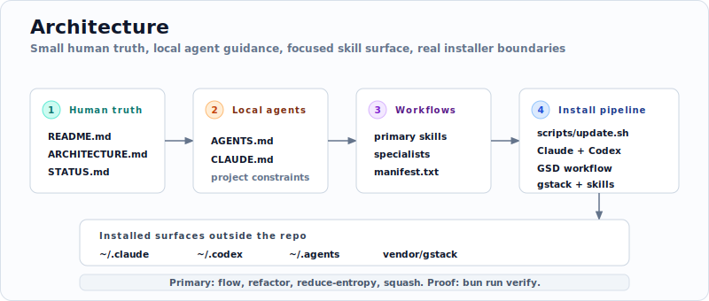

# intuitive-flow

**An opinionated operating model for agent-written software.**

`intuitive-flow` is a portable workflow kit for Claude Code and Codex. It keeps
the human surface small, puts reusable workflows in skills, and gives each repo
local `CLAUDE.md` / `AGENTS.md` guidance instead of a copied process manual.

[](LICENSE)
[](scripts/)
[](CLAUDE.md)
[](AGENTS.md)

<p align="center">
  
</p>

<p align="center">
  <a href="https://miaodx.com/LIP/share/ultrathink-to-goal/"><strong>From Ultrathink to Goal - A Year of AI Coding Engineering</strong></a><br>
  <sub><i>The interactive slide deck behind this kit · 中文</i></sub>
</p>

## Why This Exists

AI agents write all my code, so the repo needs two surfaces.

The human surface should **stay tiny**: `README.md`, `ARCHITECTURE.md`,
`STATUS.md`, and `docs/human/**`. This is where I decide what the project is,
what good means, and what must not break.

**Everything else** is agent territory: source code, plans, logs, generated
evidence, retrospectives, scratch work, and low-level churn. Humans can inspect
it when something is risky or broken. They should not have to live there.

The workflow keeps the user-facing choices small, with a clear planning to
execution boundary. For ideas or draft plans, use `$intuitive-reduce-entropy`
in plan entropy mode, optional `gstack-autoplan` unknown-unknown scouting for
non-trivial plans, `$grill-with-docs-batch`, and `$intuitive-preflight` before
`$intuitive-flow` executes. For repo maintenance, use `$intuitive-reduce-entropy`
in repo entropy mode. Use `$agent-planning-loop` when scout workers should
debate a plan before one human review packet, `$intuitive-refactor` to clean a
known target, and `$intuitive-squash` before branch handoff.
See [BELIEFS.md](BELIEFS.md) for the supporting doctrine behind the workflow;
current project truth stays in the small human surface above.

## Start In A Repo

In the target repo, give your AI agent the maintenance entrypoint and ask it to
find the ranked batch of high-value entropy reduction candidates:

```text
Read this skill:
https://github.com/MiaoDX/intuitive-flow/blob/main/skills/intuitive-reduce-entropy/SKILL.md

Then run:
Use $intuitive-reduce-entropy to make this repo easier for humans and AI agents
to work in. If agent guidance is the first entropy source, route to
$intuitive-init. Start with a ranked candidate batch before applying changes.
```

For a draft plan or idea, ask for plan entropy mode instead:

```text
Use $intuitive-reduce-entropy in plan entropy mode on docs/plans/<plan>.md.
Find missing decisions, weak assumptions, proof gaps, and unknown-unknown scout
needs before grill-batch, preflight, or execution.
```

<p align="center">
  
</p>

## Optional Tool Install (For Humans)

Clone Intuitive Flow when you want the update scripts and local skill sync:

```bash
git clone --depth=1 https://github.com/MiaoDX/intuitive-flow.git ~/intuitive-flow
~/intuitive-flow/scripts/update.sh
```

## Primary Skills

Keep the public choice small:

| Skill | Use it for |
| --- | --- |
| **intuitive-flow** | Execution router after an approved plan or preflight contract; still accepts vague prompts as a compatibility router that names the upstream planning stage |
| **intuitive-refactor** | Directly clean a known module, seam, stale API, compatibility surface, code/package/module layout issue, or architecture target |
| **intuitive-reduce-entropy** | Selects repo entropy mode for maintenance candidates or plan entropy mode for idea/plan blind spots before grill-batch and preflight |
| **agent-planning-loop** | Bounded autonomous planning loop: scouts run reduce-entropy and grill-batch style critique, while the main session judges scope and returns one review packet |
| **intuitive-squash** | Compress noisy local agent history into a clean reviewable commit story |

Common routed specialists include `$intuitive-preflight`, `$intuitive-doc`,
`$intuitive-init`, `$intuitive-tests`, and `$improve-codebase-architecture` for
report-only architecture discovery; direct-use utilities such as
`$intuitive-port-worktree`, `$multica-goal-tracker`, `$skill-runner`, and
`$simplify` are installed too. The complete default install surface lives in
`scripts/default-skill-allowlist.txt`, whose comments mark primary choices,
routed specialists, direct utilities, managed GStack tooling, and GSD status
helpers. The human-facing role audit is in
`docs/human/skill-self-improvement-audit.md`.

## Human Docs

- [README.md](README.md): orientation, install commands, and public project map
- [ARCHITECTURE.md](ARCHITECTURE.md): subsystem contracts, extension points, and proof boundaries
- [STATUS.md](STATUS.md): current state, supported commands, and next maintenance focus
- [docs/human/](docs/human/): human-facing detail that should not bloat root docs
- [Agent harness references](docs/human/agent-harness-references.md): official
  and field-practice sources that guide agent guidance, skills, hooks, and MCP setup
- [Reduce repo entropy](docs/human/reduce-repo-entropy.md): copy/paste prompt
  for periodic repo maintenance

Generated diagrams, release-note analysis, vendored tools, planning scratchpads,
and implementation evidence are context, not current truth unless a human doc
promotes them.

## Scripts

| Script | Purpose |
| --- | --- |
| `bun run audit:skill-upstreams` | Read-only audit for candidate skills in upstream skill repos that are outside the default allowlist |
| `bun run check:skills` | Validate repo-owned skills, default allowlist coverage, frontmatter, local resource links, completed-plan archival markers, and Bun toolchain pin alignment |
| `bun run check:shell` | Run ShellCheck error-level validation for the updater, Bash helper scripts, and the Git hook entrypoint |
| `bun run setup:hooks` | Configure this checkout to use repo-owned Git hooks from `.githooks/` |
| `scripts/update.sh` | Install or update agent surfaces, skills, commands, GSD, and gstack |
| `scripts/dev/*.sh` | Local developer utilities for tmux and workstation sessions |
| `scripts/support/tmp-fix.sh` | Idempotent updater patch hook used by `scripts/update.sh --tmp-fix` |

`scripts/update.sh` uses the direct npm registry by default. Pass
`--npm-mirror` to force mirror registry access for every npm/npx task.

For script development:

```bash
bun install
bun run setup:hooks
bun run verify
```

## How It Works

<p align="center">
  
</p>

Human docs define repo truth, `AGENTS.md` and `CLAUDE.md` stay project-local,
`skills/` is the canonical repo-owned skill surface, and `scripts/update.sh`
syncs Claude Code, Codex, GSD, gstack, external skills, and repo-owned skills
into user-level tooling according to `scripts/default-skill-allowlist.txt`. See
[ARCHITECTURE.md](ARCHITECTURE.md) for subsystem contracts and proof
boundaries.

## Contributing

PRs are welcome from humans and AI agents. The most useful contributions are
sharper shared rules and fixes to workflows that drift as the underlying CLIs evolve.

Less is more.

## License

MIT - see [LICENSE](LICENSE).
